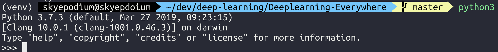
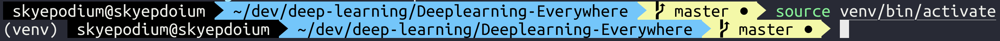
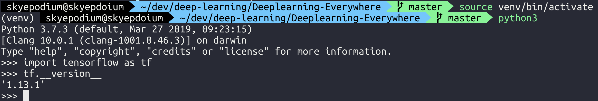

# 텐서플로우 설치 및 실행
텐서플로우를 설치하고 한번 실행해봅니다.

## 1. 텐서플로우 란?
- 텐서플로우란 구글에서 제공하는 머신러닝을 위한 오픈소스 라이브러리
- 데이터 플로우 그래프를 이용해서 수학적인 계산을 할 수 있는 라이브러리
- 파이썬을 사용할 수 있습니다.

텐서플로우 이외에도 많은 라이브러리가 있습니다만, 왜 텐서플로우를 사용하는가요?

- 많은 사람들이 사용하기 때문에 공부할 수 있는 자료가 많습니다.

## 2. Data Flow Graph 란?

그래프 - 정점(node)과 간선(edge)으로 이루어진 자료구조

data flow graph에서

노드 - 하나의 오퍼레이션(어느 값을 받으면 이런 행동을 한다.)

간선 - 데이터 배열(tensor)

## 3. 설치
### 0) 파이썬3가 설치되어있는지 확인

```
# cmd창 또는 터미널에서 다음을 입력합니다.
python3
```
사진과 같이 버전 정보가 나오면 설치되어있는것입니다.


### 1) 작업을 진행할 빈 폴더 생성
```
# mac 또는 linux 사용자라면
mkdir Deeplearning-test

# 윈도우 사용자이시면 윈도우 탐색기의 새폴더 만들기로 만드셔도 괜찮습니다.
```
### 2) 파이썬 라이브러리를 저장할 가상환경을 생성합니다.
저는 텐서플로우 라이브러리가 노트북의 전역으로 설치되는 것을 원하지 않습니다. 프로젝트 마다 독립적인 라이브러리를 원하기 때문에 가상환경을 사용했습니다.
- [가상환경에 대한 설명](https://dojang.io/mod/page/view.php?id=2470)
```
# 두번째 venv는 생성할 가상환경의 이름입니다.
python3 -m venv venv
```

### 3) 가상환경 실행
```
# mac, linux 사용자
source vevn/bin/activate

# window 사용자
cd venv
Scripts\activate.bat

# deactivate 명령어는 가상환경을 해제합니다. (지금은 하지 마세요!)
deactivate 
```
사진과 같이 괄호안에 가상환경의 이름이 나타나면 실행된것입니다.



### 4) 텐서플로우 설치
```
# pip3를 사용하기 때문에 필요는 없는데 자꾸 warning보여주니 upgrade 해줍니다.(갠취)
pip install --upgrade pip

# 텐서플로우를 설치합니다. (가상환경에 tensorflow가 설치됩니다.)
pip3 install tensorflow --upgrade
```

### 5) 텐서플로우 설치 확인
```
# 가상환경을 실행한 상태에서
python3
import tensorflow as tf
tf.__version__
```
사진과 같이 버전 정보가 나오면 설치가 된것입니다.

